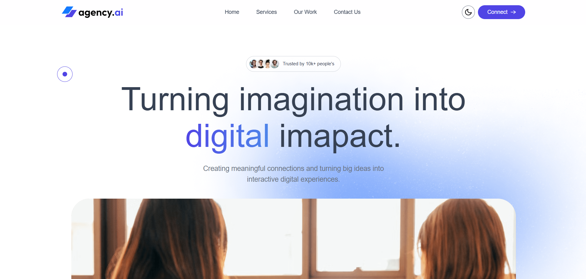

# Agency.ai – Responsive Landing Page

Agency.ai is a modern, responsive landing page designed to showcase digital services with clarity and impact. The project focuses on clean UI, reusable components, and conversion-driven design to deliver a seamless user experience.

### Live Demo
https://agency-ai-pink.vercel.app/

### Preview

### Features
- Fully responsive design across all devices  
- Clean and modern UI/UX  
- Reusable and well-structured components  
- Smooth navigation and layout flow  
- Integrated animations to enhance user interaction and visual appeal  
- Contact form powered by Web3Forms for seamless form submission without backend setup  

### Tech Stack
- React.js
- Tailwind CSS
- Framer Motion

### What I Learned
- Developed a strong understanding of building responsive layouts using modern CSS techniques
- Improved ability to structure clean and maintainable UI components
- Gained experience in designing user-centric interfaces with a focus on usability and visual hierarchy
- Learned how to organize content effectively for landing pages to improve engagement and conversion
- Strengthened skills in writing scalable and readable frontend code
- Practiced translating design concepts into functional web interfaces
