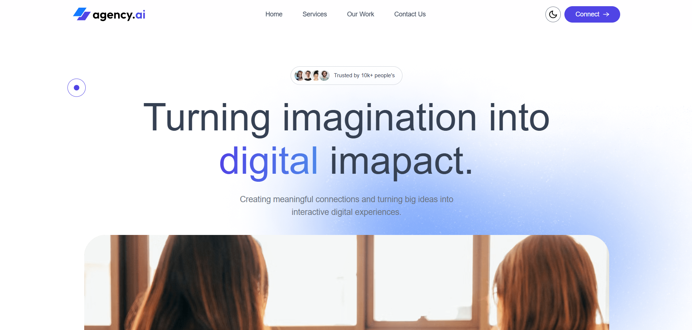

# Agency.ai – Responsive Landing Page

Agency.ai is a modern, responsive landing page designed to showcase digital services with clarity and impact. The project focuses on clean UI, reusable components, and conversion-driven design to deliver a seamless user experience.

### Live Demo
https://agency-ai-pink.vercel.app/

### Preview

### Features
- Modern UI Development – Built a clean and interactive user interface using React.js component-based architecture.
- Responsive Design – Ensures seamless performance across all devices and screen sizes using Tailwind CSS mobile-first responsive design.
- Interactive Animations – Enhanced user engagement and visual appeal using Framer Motion animations.
- Contact Form Integration – Enables seamless client inquiry and request submission using Web3Forms API integration without backend setup.
- Real-Time Notifications – Displays instant form submission success messages using React Hot Toast.

### Tech Stack
- React.js
- Tailwind CSS
- Framer Motion
- Web3forms
- React-hot-toast

### What I Learned
- Building responsive, mobile-first web interfaces using Tailwind CSS.
- Developing reusable and scalable UI components with React.
- Integrating third-party form handling services like Web3Forms for seamless contact form submissions.
- Implementing real-time user feedback with React Hot Toast.
- Creating smooth and engaging user interactions using Framer Motion.
